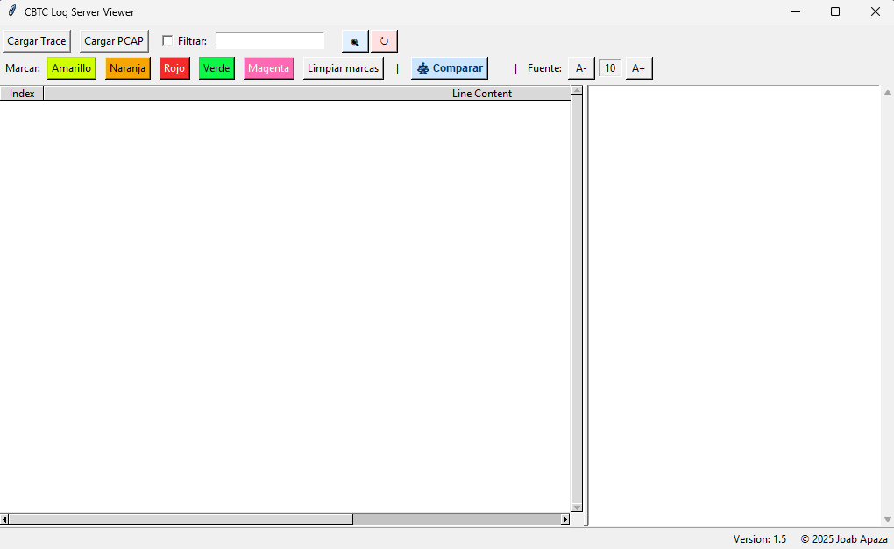
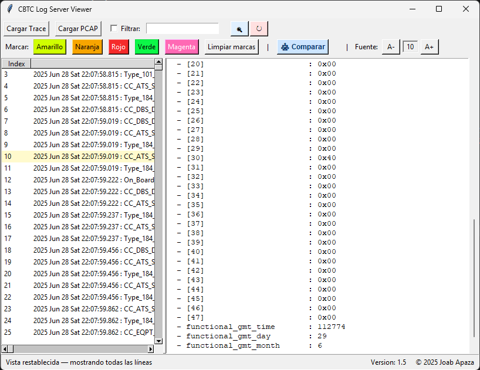
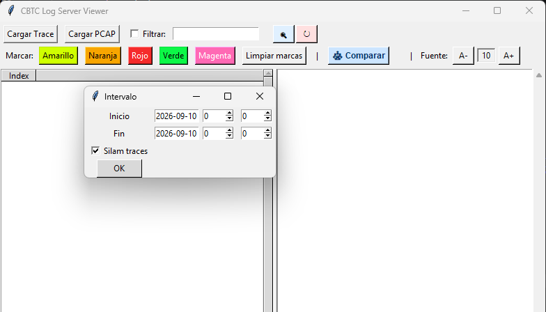

# CBTC Server logs Viewver

Python tool designed to improve the visualization, analysis, and interpretation of CBTC communication messages, reducing troubleshooting time and facilitating incident investigation for maintenance team - Linea 2 Lima Proyect.

> ⚠️ Public showcase repository.
> Source code is maintained in a private repository due to security.

---

## Overview

CBTC server logs viewer provides a more efficient way to inspect communication logs and operational messages generated by CBTC systems. At the begining only for FRONTAM messages... now DCS CBTC messages.

The application was developed to simplify the analysis process by presenting information in a clearer and more structured format than raw log files.

---

## Main Features

✅ Enhanced visualization of CBTC messages

✅ Message filtering by type and content

✅ Highlighting of relevant events

✅ Faster navigation through large log files

✅ Dedicated decoding windows

✅ Improved readability for troubleshooting activities

---

## Screenshots

### Main Interface

### Messages

### Import Silam and Wireshark logs

---

## Development History

### June 2025
- Initial concept just Frontam traces in a nice way :)

### October 2025
- Adding colors and filters, using "+" and "|"

### January 2026
- Comparing mode, to view when a value chages.

### March 2026
- Decoding windows added for selected message types.

### June 2026
- Now Silam traces are included, just for the mirror logs, they contain CBTC messages

### September 2026
- Reorganize the windows, order the general structure, more modular.
- Filter Silam by datetime (recommended 15 min max)

### October 2026
- Adding Wireshark traces

---

## Author

**Joab Apaza**

Signalling Systems Maintenance Engineer

Railway Signalling & CBTC Systems
